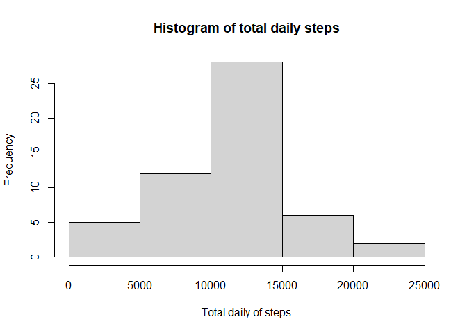
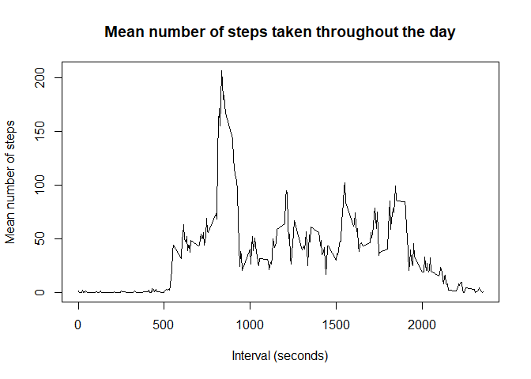
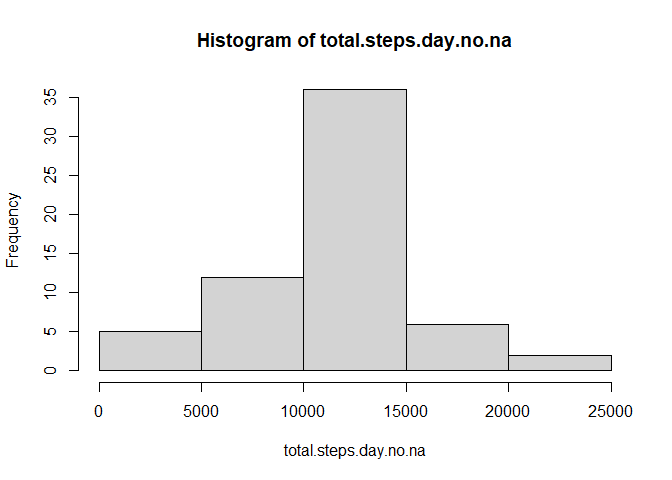
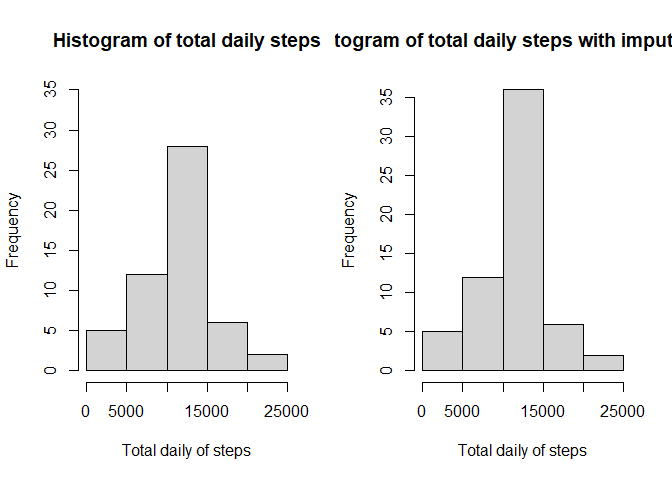
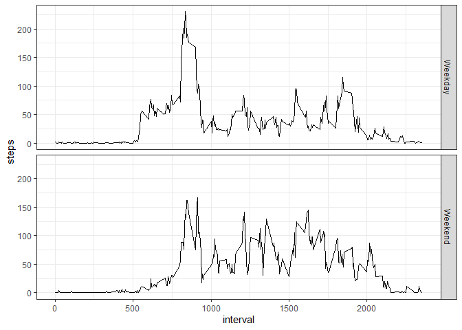

## Step 1: Load the data
First step is to set your working directory, download and load the data. The, we check how does it looks like. Attention to header and NA strings.

```r
if(!file.exists("getdata-projectfiles-UCI HAR Dataset.zip")) {
        temp <- tempfile()
        download.file("http://d396qusza40orc.cloudfront.net/repdata%2Fdata%2Factivity.zip",temp)
        unzip(temp)
        unlink(temp)
}

activity <- read.csv("activity.csv", header=TRUE, na.strings = "NA")
print(head(activity))
```

```
##   steps       date interval
## 1    NA 2012-10-01        0
## 2    NA 2012-10-01        5
## 3    NA 2012-10-01       10
## 4    NA 2012-10-01       15
## 5    NA 2012-10-01       20
## 6    NA 2012-10-01       25
```

## Step 2: Verify data format
Before preprocessing, variables class must be verified and converted is required.

```r
class(activity$steps)
```

```
## [1] "integer"
```

```r
class(activity$date)
```

```
## [1] "character"
```

data format is OK. Date varible shall be converted later from factor to date if calculation is needed.

## Step 3: Calculate the total number of steps taken per day
Now we want to calculate the total number of steps for each day. For that, we can use the tapply function and use the 'date' as grouping variable.

```r
total.steps.day <- tapply(activity$steps, activity$date, FUN=sum)
print(head(total.steps.day))
```

```
## 2012-10-01 2012-10-02 2012-10-03 2012-10-04 2012-10-05 2012-10-06 
##         NA        126      11352      12116      13294      15420
```

## Step 4: Plot histogram of total.steps.day
Then, we can plot the total number of steps for each day and see how they varied in the dataset (i.e. its distribution)

```r
hist(total.steps.day, xlab = "Total daily of steps", main = "Histogram of total daily steps")
```

<!-- -->

The variable shows almost a normal distribution.

## Step 5: Calculate mean and median of total.steps.day
We can calculate the mean and median of the total daily steps. Attention to the NA values that should be ignored according to assignment instructions.

```r
mean.steps <- mean(total.steps.day, na.rm = TRUE)
mean.steps
```

```
## [1] 10766.19
```

```r
median.steps <- median(total.steps.day, na.rm = TRUE)
median.steps
```

```
## [1] 10765
```

As presumed after step 4, the mean and median are very similar. This indicates a normal distribution.

## Step 6: Time series plot
Now, we would like to calculate the mean number of steps throughout the day for all days. For that, I calculated the mean  for each 5 minutes interval, that ranged fro 0 to 2355. Ps: this range is not clear for me since a day has 1440 minutes. Nevertheless, I assumed the dataset was correct for the matter of this exercise.

```r
mean.steps.interval <- tapply(activity$steps, activity$interval, FUN=mean, na.rm=TRUE)
interval <- unique(activity$interval)
plot(interval, mean.steps.interval, type ="l", ylab = "Mean number of steps", xlab = "Interval (seconds)", main = "Mean number of steps taken throughout the day")
```

<!-- -->

## Step 7: Maximum average steps by interval
Then, we would like to know when (i.e. the time interval) the maximum mean step usually (or in average) occured

```r
interval[which.max(mean.steps.interval)]
```

```
## [1] 835
```

The maximum mean value occured at 835 minutes, exceding 200 steps/5 minutes.

## Step 8: Number of NA
Now we would like to acess if the presence of NA might impact our analysis. For that, I calculated the total number of missing values.

```r
sum(is.na(activity$steps))
```

```
## [1] 2304
```

## Step 9: Replace NA values by the mean step value for each interval
After that, I replaced the missing values by the respective mean value according to the interval in which the missing value was.

```r
na.rows <- which(is.na(activity$steps))
na.interval <- as.data.frame(activity$interval[na.rows])
df1 <- cbind(mean.steps.interval, interval)
df1 <- as.data.frame(df1)

library("dplyr")
```

```
## Warning: package 'dplyr' was built under R version 4.0.2
```

```
## 
## Attaching package: 'dplyr'
```

```
## The following objects are masked from 'package:stats':
## 
##     filter, lag
```

```
## The following objects are masked from 'package:base':
## 
##     intersect, setdiff, setequal, union
```

```r
df2 <- left_join(na.interval, df1, by = c("activity$interval[na.rows]" = "interval"))
print(head(df2))
```

```
##   activity$interval[na.rows] mean.steps.interval
## 1                          0           1.7169811
## 2                          5           0.3396226
## 3                         10           0.1320755
## 4                         15           0.1509434
## 5                         20           0.0754717
## 6                         25           2.0943396
```

After this, we have a new dataset without missing values, which were replaced by the mean values of the respective interval.

## Step 10: Create new data set with NA data filled in
After this, we have a new dataset without missing values, which were replaced by the mean values of the respective interval.

```r
activity.no.na <- activity
activity.no.na$steps[which(is.na(activity.no.na$steps))] <- df2$mean.steps.interval
print(head(activity.no.na))
```

```
##       steps       date interval
## 1 1.7169811 2012-10-01        0
## 2 0.3396226 2012-10-01        5
## 3 0.1320755 2012-10-01       10
## 4 0.1509434 2012-10-01       15
## 5 0.0754717 2012-10-01       20
## 6 2.0943396 2012-10-01       25
```

## Step 11: Plot histogram of total.steps.day.no.na
With the new dataset, we can verify if the frequency distribution of the dataset may have changed after Steps 9 and 10.

```r
total.steps.day.no.na <- tapply(activity.no.na$steps, activity.no.na$date, FUN=sum)
hist(total.steps.day.no.na)
```

<!-- -->

## Step 12: Calculate mean and median of total.steps.day.no.na
Further, we can calculate the new means and medians of the dataset.

```r
mean.steps.no.na <- mean(total.steps.day.no.na, na.rm = TRUE)
mean.steps.no.na
```

```
## [1] 10766.19
```

```r
median.steps.no.na <- median(total.steps.day.no.na, na.rm = TRUE)
median.steps.no.na
```

```
## [1] 10766.19
```

## Step 13: Assess impact of no.na
The inclusion of missing data as the average of the respective interval during the day did not considerable impact the distribution of the total steps, as seen while comparing both histograms of total.steps.day and total. steps.day.no.na

```r
par(mfrow = c(1,2))
hist(total.steps.day, xlab = "Total daily of steps", main = "Histogram of total daily steps", ylim=c(0,35))
hist(total.steps.day.no.na, xlab = "Total daily of steps", main = "Histogram of total daily steps with imputed data")
```

<!-- -->

Further, the addition of the NA values did not affect the mean and median of the dataset, that remained around 10766 steps per day.

```r
ct <- rbind(mean.steps,mean.steps.no.na,median.steps,median.steps.no.na)
ct<-as.data.frame(ct)
names(ct)[1] <- "steps"
print(ct)
```

```
##                       steps
## mean.steps         10766.19
## mean.steps.no.na   10766.19
## median.steps       10765.00
## median.steps.no.na 10766.19
```

## Step 14: Factor weekday and weekend
Lastly, we would like to assess if the daily pattern of walking varies according to weekdays or weekends. For that, the dates should be converted to weekdays or weekends.

```r
#convert into date
activity.no.na$date <- as.Date(activity.no.na$date)

#create nem column to assign days of the week
activity.no.na$dayoftheweek <- weekdays(activity.no.na$date)

#create factors of weekdays
weekdays <- c("Monday","Tuesday","Wednesday","Thursday","Friday")

#create logical vector of weekdays
factor <- activity.no.na$dayoftheweek %in% weekdays
factor <- factor(factor, levels=c(TRUE, FALSE), labels = c("Weekday", "Weekend"))

#add logical vector to dataframe
activity.no.na<-cbind(activity.no.na,factor)
print(head(activity.no.na))
```

```
##       steps       date interval dayoftheweek  factor
## 1 1.7169811 2012-10-01        0       Monday Weekday
## 2 0.3396226 2012-10-01        5       Monday Weekday
## 3 0.1320755 2012-10-01       10       Monday Weekday
## 4 0.1509434 2012-10-01       15       Monday Weekday
## 5 0.0754717 2012-10-01       20       Monday Weekday
## 6 2.0943396 2012-10-01       25       Monday Weekday
```

## Step15: Plot time series grouped by weekend or weekday
After the addition of the weekend/weekday factor in the dataset, we can calculate the mean steps throughout the day for only the weekdays and only the weekends. Then, we can compare them and see if they differ.

```r
#filter weekdays and weekends
activity.no.na.weekday <- filter(activity.no.na, activity.no.na$factor == "Weekday")
activity.no.na.weekend <- filter(activity.no.na, activity.no.na$factor == "Weekend")

#calculate mean steps for each interval for both weekdays and weekend
mean.steps.interval.weekday <- as.data.frame(tapply(activity.no.na.weekday$steps, activity.no.na.weekday$interval, FUN=mean, na.rm=TRUE))
interval.no.na.weekday <- as.data.frame(unique(activity.no.na.weekday$interval))
mean.weekday <- cbind(mean.steps.interval.weekday,interval.no.na.weekday)
names(mean.weekday)[1] <- "mean steps"
names(mean.weekday)[2] <- "interval"
mean.weekday$factor <- "Weekday"


mean.steps.interval.weekend <- as.data.frame(tapply(activity.no.na.weekend$steps, activity.no.na.weekend$interval, FUN=mean, na.rm=TRUE))
interval.no.na.weekend <- as.data.frame(unique(activity.no.na.weekend$interval))
mean.weekend <- cbind(mean.steps.interval.weekend,interval.no.na.weekend)
names(mean.weekend)[1] <- "mean steps"
names(mean.weekend)[2] <- "interval"
mean.weekend$factor <- "Weekend"


#plot 2 facet timeseries graph
mean.no.na.all <- rbind(mean.weekend, mean.weekday)
names(mean.no.na.all)[1] <- "steps"

library(ggplot2)
```

```
## Warning: package 'ggplot2' was built under R version 4.0.2
```

```r
bp <- ggplot(mean.no.na.all, aes(x=interval, y=steps))+geom_line()+facet_grid(row=vars(factor)) + theme_bw()
bp
```

<!-- -->

While during the weekdays the step peak was concentrated aroun 835 and surpassed 250 steps/5minutes, during the weekends the rate of steps/5 minutes rarely surpassed 150 and was more evenly distributed from 800 to 1750 minutes.
